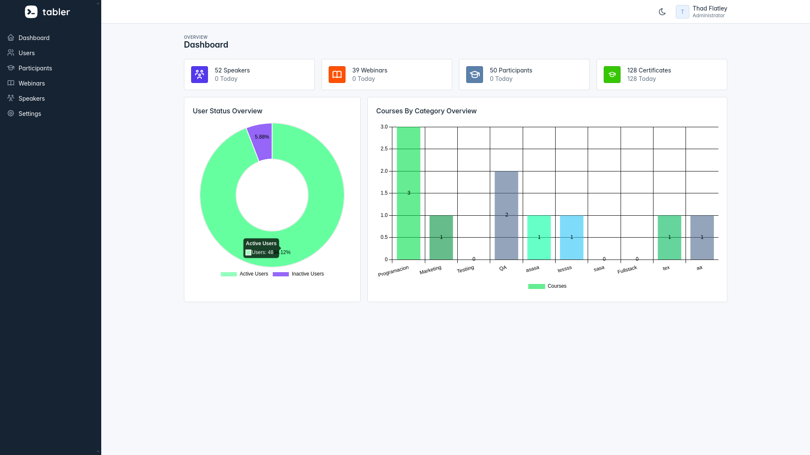
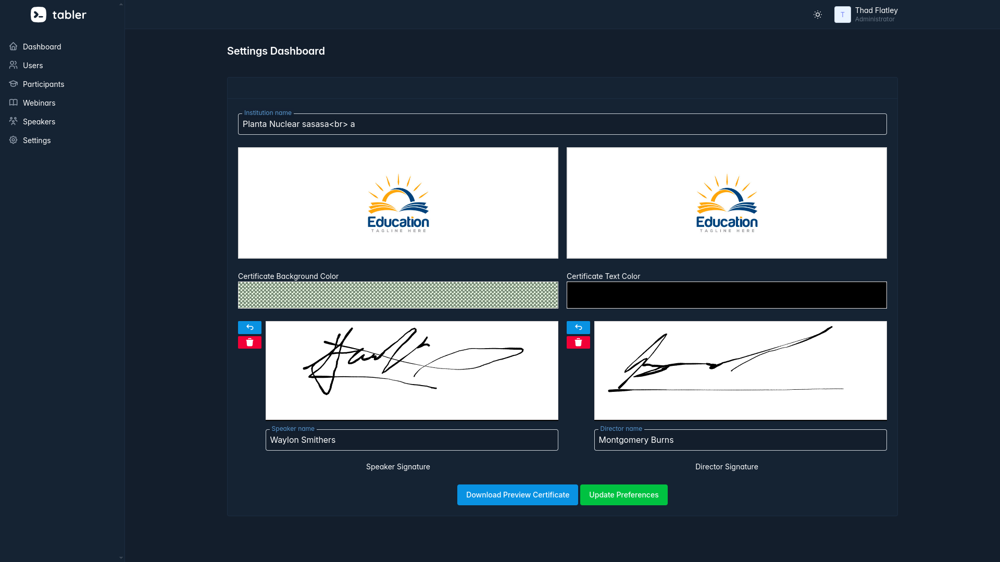

<h1 align="center">
  🎓 Educertify
</h1>
<h4 align="center">Revolutionizing Certificate Creation and Management</h4>
<p align="center">
  <a href="#key-features">Key Features</a> •
  <a href="#how-it-works">How It Works</a> •
  <a href="#getting-started">Getting Started</a> •
  <a href="#tech-stack">Tech Stack</a> •
  <a href="#showcase">Showcase</a> •
  <a href="#roadmap">Roadmap</a> •
  <a href="#contributing">Contributing</a> •
  <a href="#support">Support</a>
</p>
<p align="center">
  
</p>
<p align="center">
  <a href="https://github.com/carlosJCVC/EduCertify/stargazers"></a>
  <a href="https://github.com/carlosJCVC/EduCertify/network"></a>
  <a href="https://github.com/carlosJCVC/EduCertify/issues"></a>
  <a href="https://github.com/carlosJCVC/EduCertify/blob/master/LICENSE"></a>
  <a href="https://twitter.com/intent/tweet?text=Check%20out%20Educertify!%20https://github.com/carlosJCVC/EduCertify"></a>
</p>

---

# 🎓 Educertify

**Educertify** is a web application that allows for the creation and customization of certificates in an easy and intuitive way. You can customize fonts, colors, add signatures, and also upload signed certificates or digitally sign them.

## 🌟 Key Features

Educertify isn't just another certificate maker. It's a comprehensive platform designed to streamline the entire process of creating, managing, and distributing certificates.

- **🎨 Full Customization**: Tailor every aspect of your certificates:
   - Choose from a variety of fonts
   - Select custom colors
   - Adjust text styles and positioning
- **📚 Digital Signatures**: Allows adding digital signatures or uploading already signed certificates.
   - Add digital signatures directly in the app
   - Upload pre-signed certificates
- **🔄 Bulk Generation**: Create thousands of certificates in seconds
- **📄 PDF Download**: Generate and download certificates in PDF format.
- **📧 Email Integration**: Send certificates directly to participants
- **📱 Mobile Responsive**: Design and view certificates on any device

## 🚀 Getting Started

```bash
# Clone the repository
git clone https://github.com/usuario/educertify.git

# Navigate to the project directory
cd educertify

# Install dependencies
composer install && npm install

# Set up environment variables
cp .env.example .env
php artisan key:generate

# Run migrations and seed the database
php artisan migrate --seed

# Compile assets
npm run dev

# Start the development server
php artisan serve
```

Visit `http://localhost:8000` and start revolutionizing your certificate process!

## 🛠️ Technologies Used

<p align="center">
  
  
  
  
  
</p>

- **Backend**: Laravel (PHP)
- **Frontend**: Bootstrap, Tabler, CSS, jQuery, JavaScript, Blade, SweetAlert, Toastr
- **Database**: MySQL, PostgreSQL

## 🖥️ Usage

1. **Register/Login**: Create an account or log in to access the dashboard.
2. **Select Template**: Choose from pre-designed templates or start from scratch.
3. **Customize**: Use the real-time editor to personalize your certificate.
4. **Add Signatures**: Digitally sign or upload signatures as needed.
5. **Preview**: Review your certificate before finalizing.
6. **Download/Send**: Generate a PDF or email the certificate directly to recipients.

## 📸 Screenshots

Here are some screenshots of the application in action:

1. **Dashboard**
   

2. **Certificate Customization**
   

3. **PDF Download**
   

4. **Send Certificates to the Participants**
   

## 🤝 Contributions

We welcome contributions to Educertify! Here's how you can help:

1. Fork the repository
2. Create your feature branch (`git checkout -b feature/AmazingFeature`)
3. Commit your changes (`git commit -m 'Add some AmazingFeature'`)
4. Push to the branch (`git push origin feature/AmazingFeature`)
5. Open a Pull Request

## 📜 License

This project is licensed under the MIT License - see the [LICENSE](LICENSE) file for details.

## 📞 Contact

If you have any questions or suggestions, you can contact me at [carlosveizaga.jcvc@gmail.com](mailto:carlosveizaga.jcvc@gmail.com).
Carlos Veizaga - [@YourTwitter](https://twitter.com/YourTwitter) - carlosveizaga.jcvc@gmail.com
Project Link: [https://github.com/usuario/educertify](https://github.com/usuario/educertify)

## 🙏 Acknowledgements

- [Laravel](https://laravel.com/)
- [Bootstrap](https://getbootstrap.com/)
- [Tabler](https://tabler.io/)
- [SweetAlert](https://sweetalert2.github.io/)
- [Toastr](https://github.com/CodeSeven/toastr)

<p align="center">
  Made with ❤️ by the Carlos Veizaga Developer
</p>

---
