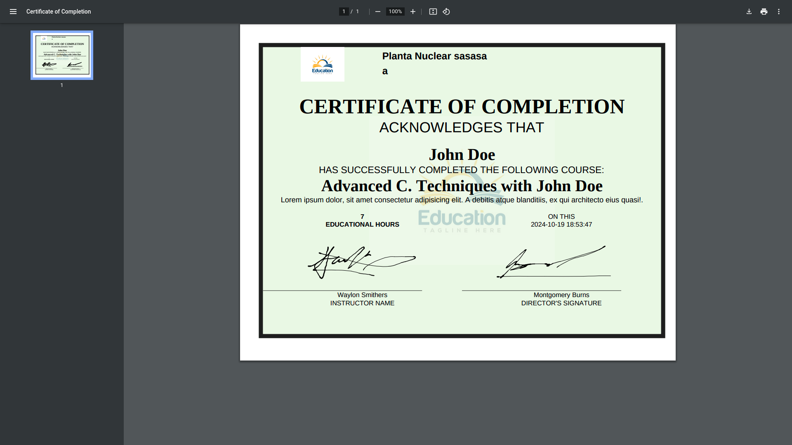
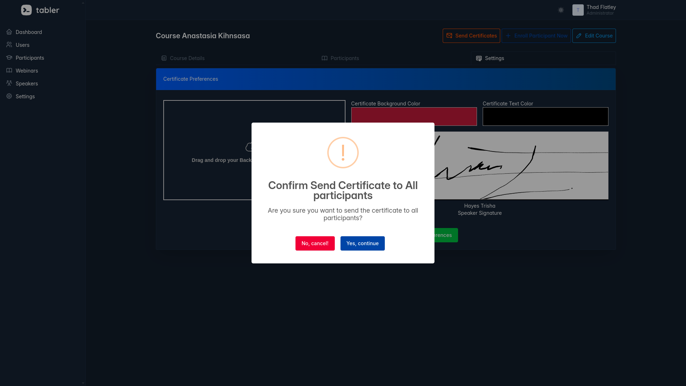

<h1 align="center">
  <br>
  
  <br>
  Educertify
  <br>
</h1>
<h4 align="center">Revolutionizing Certificate Creation and Management</h4>
<p align="center">
  <a href="#key-features">Key Features</a> •
  <a href="#how-it-works">How It Works</a> •
  <a href="#getting-started">Getting Started</a> •
  <a href="#tech-stack">Tech Stack</a> •
  <a href="#showcase">Showcase</a> •
  <a href="#roadmap">Roadmap</a> •
  <a href="#contributing">Contributing</a> •
  <a href="#support">Support</a>
</p>
<p align="center">
  
</p>
<p align="center">
  <a href="https://github.com/carlosJCVC/EduCertify/stargazers"></a>
  <a href="https://github.com/carlosJCVC/EduCertify/network"></a>
  <a href="https://github.com/carlosJCVC/EduCertify/issues"></a>
  <a href="https://github.com/carlosJCVC/EduCertify/blob/master/LICENSE"></a>
  <a href="https://twitter.com/intent/tweet?text=Check%20out%20Educertify!%20https://github.com/carlosJCVC/EduCertify"></a>
</p>

# Educertify

**Educertify** is a web application that allows for the creation and customization of certificates in an easy and intuitive way. You can customize fonts, colors, add signatures, and also upload signed certificates or digitally sign them.

## Features

- **Full Customization**: Change the font, color, and text style of the certificates.
- **Digital Signatures**: Allows adding digital signatures or uploading already signed certificates.
- **Real-Time Editor**: Preview changes in real-time while customizing your certificate.
- **PDF Download**: Generate and download certificates in PDF format.

## Technologies Used

- **Backend**: Laravel, PHP
- **Frontend**: Bootstrap, Tabler, CSS, jQuery, JavaScript, Blade, SweetAlert, Toastr
- **Database**: MySQL, PostgreSQL


## Installation

1. Clone the repository:

   ```bash
   git clone https://github.com/usuario/educertify.git
   ```

2. Navigate to the project directory:

   ```bash
   cd educertify
   ```

3. Install Composer dependencies:

   ```bash
   composer install
   ```

4. Install Node.js dependencies:

   ```bash
   npm install
   ```

5. Configure the `.env` file:

   ```bash
   cp .env.example .env
   ```
   Set up the environment variables, including the database connection and keys for signing certificates. You can choose between MySQL or PostgreSQL as your database.

6. Generate the application key:

   ```bash
   php artisan key:generate
   ```

7. Run the migrations:

   ```bash
   php artisan migrate
   ```

8. Compile the frontend assets:

   ```bash
   npm run dev

9. Start the server:

   ```bash
   php artisan serve
   ```

   The application will be available at `http://localhost:8000`.

## Usage

- Navigate to the application URL.
- Register or log in.
- Select a certificate template to customize.
- Add and adjust texts, colors, and signatures as needed.
- Download the customized certificate in PDF format.

## Screenshots

Here are some screenshots of the application in action:

1. **Dashboard**
   

2. **Certificate Customization**
   

3. **PDF Download**
   

4. **Send Certificates to Participants**
   

## Contributions

Contributions are welcome.

Make a pull request when your changes are ready to be reviewed.

## License

This project is licensed under the MIT License. For more details, check the `LICENSE` file.

## Contact

If you have any questions or suggestions, you can contact me at [carlosveizaga.jcvc@gmail.com](mailto:carlosveizaga.jcvc@gmail.com).
